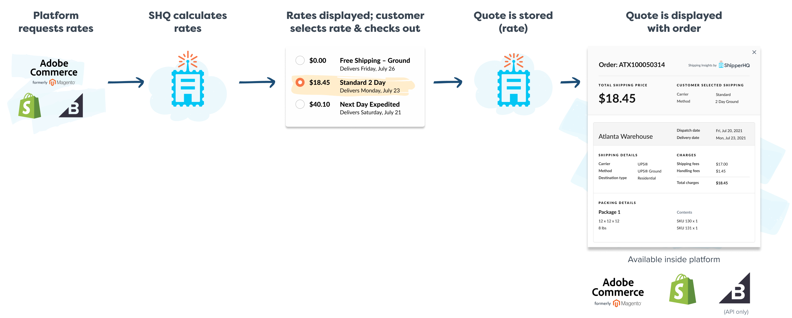

ShipperHQ generates a significant amount of detail about each shipment for which it generates shipping rates and options each time an application calls the Rates API. Once the ShipperHQ account associated with the rating call has the [Shipping Insights](https://docs.shipperhq.com/shipping-insights-configuration/) Advanced Feature enabled, ShipperHQ stores these shipment details for later retrieval with the Insights API.

When using the ShipperHQ native integrations with [Magento 2](https://docs.shipperhq.com/installing-magento-2-shipperhq-extension/), [BigCommerce](https://docs.shipperhq.com/setup-shipperhq-bigcommerce-store/), or [Shopify](https://docs.shipperhq.com/connect-shopify-shipperhq/), enabling the Shipping Insights Advanced Feature will automatically store shipment information when a customer completes a checkout. For other platforms or custom integrations, you have to use the [`PlaceOrder`](labels/place-order.md) mutation of the [Labels API](labels/overview.md) to capture a successful checkout and store shipment information. In either case, the Order Number is attached to the shipment information when stored and is used to look up for this shipment information using the Insights API.

## Workflow

1. The [Rates API](rates/overview.md) receive a rate request
2. ShipperHQ generates rates and options and returns them
3. When the customer completes checkout, a call to [`PlaceOrder`](labels/place-order.md) causes ShipperHQ to capture this quote as an order with a unique identifier (Order Number)
4. Order and shipment details are then available via the Insights API

## Key queries
The Insights API is a read-only API that returns shipment details for shipments rated with the [Rates API](rates/overview.md).

| Query                      | Description         |
| ---------------------------|---------------------|
| `viewOrder`    |	Given an order number, retrieves shipment information for that order. |

:::tip `PlaceOrder` mutation

Implementation of the related [`PlaceOrder`](labels/place-order.md) mutation of the [Labels API](labels/overview.md) may be required to use Shipping Insights. However, this is only the case if you are **not** using the native ShipperHQ apps/plugins/extensions on Magento/Adobe Commerce, BigCommerce, Shopify, SalesForce B2C Commerce Cloud, WooCommerce, Zoey - [complete list here](https://shipperhq.com/pricing)). When using the native ShipperHQ integration with any of these platforms, the PlaceOrder function occurs automatically, so you can use the Insights API without implementing PlaceOrder yourself.

:::
