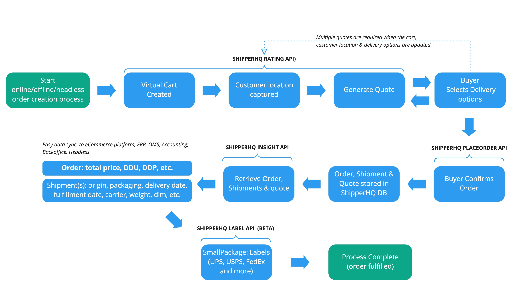

# SDK Use Cases

## Overview

The ShipperHQ SDK provides an end to end solution to help merchants, developers, and partners integrate with ShipperHQ for purposes and in places not currently available through the native ShipperHQ and eCommerce platform experience. This means being able to take advantage of ShipperHQ's advanced shipping functionality wherever it's needed without having to build a fully custom solution.

### High-level Workflow

While developers can use each API independently, the goal of the ShipperHQ SDK is to make it easy to integrate with the full ShipperHQ workflow following this sequence:
  1. [Rate API](/docs/rate/overview)
  2. [PlaceOrder Mutation](/docs/insight/place-order) (not required for most major eCommerce platforms)
  3. [Insight API](/docs/insight/overview)
  4. [Label API](/docs/label/overview) (in beta)

## Use cases and existing integrations

To illustrate what can be achieved with ShipperHQ SDK, here are some example of integrations that have been successfully built using the SDK.

### CRM integration

Give customer service teams full visibility of the delivery option selected by a customer when they place an order. And, give the team shipping rates and options that respect complex business logic configured in ShipperHQ when placing or adjusting orders on behalf of customers. Shiping quotes can be live and accurate instead of estimated plus the sales person can see additional information like expected delivery date (if configured in ShipperHQ).

This would require minimally:
* [Rate API](/docs/rate/overview) to get rates
* [PlaceOrder Mutation](/docs/insight/place-order) to capture successful orders placed or updated via the CRM
* [Insight API](/docs/insight/overview) to display full shipping details

### ERP integration

When creating draft-orders or manual orders, rates can be retrieved from ShipperHQ so that the order shipping costs can be accurately set. It enables multi-channel orders (online, offline, direct sale, etc.) to use the exact same logic, or variations of it, for shipping & delivery rates. The shipping rates returned by ShipperHQ can be overriden in your ERP following your own business rules and authorization system. Usually the ERP inform the rate engine of the various `shipping-groups` for the products, present origin-locations with inventory and more to leverage key ShipperHQ functionalities like multi-origin or multi-shipment fulfillment as well as differentiate small-packages vs freight orders.

This would require minimally:
1. [Rate API](/docs/rate/overview) to get rates
2. [PlaceOrder Mutation](/docs/insight/place-order) to capture successful orders

To visualize (or sync) the exact orders (order management):
* [Insight API](/docs/insight/overview) to fulfill efficiently based on ShipperHQ rate at checkout recommendation

To print the corresponding labels:
*  [Label API (in beta)](/docs/label/overview)

### Order Management System integration

ShipperHQ customers uses various order management systems and the Insight API is a key to leverage the detailed shipment information produced by ShipperHQ during rating at time of fulfillment.

The [Insight API](/docs/insight/overview) enables order management systems to access:
- Ship-from (Origin) locations for each shipment and item
- Box/package sizes and types for each shipment
- Label provider for each shipment
- Service class for each shipment
- Delivery date & time and expected dispatch date for each shipment

This would require minimally:
* [Insight API](/docs/insight/overview)

### eCommerce platform integration

While ShipperHQ support the major eCommerce platforms, the [Rate API](/docs/rate/overview) means developers can integrate ShipperHQ to provide rates at checkout in any eCommerce platform. This means being able to leverage the rich functionality of ShipperHQ's rules engine and advanced functions. For this use case, the [Rate API](/docs/rate/overview) can be called at any point where shipping rates are needed such as product pages, carts, and checkout.

This would require minimally:
* [Rate API](/docs/rate/overview)

For full functionality, adding integrations with the [PlaceOrder Mutation](/docs/insight/place-order) and [Insight API](/docs/insight/overview) would allow display of rich shipment information within the eCommerce platform admin.

### Headless commerce

No need for an eCommerfce platform. With the ShipperHQ SDK you can build your own experience using whichever tools and technologies that you select. The [Rate API](/docs/rate/overview) will enable you to focus on the user experience while all the business logic is configured in ShipperHQ. The [Insight API](/docs/insight/overview) will allow you to place orders and retrieve all the fulfillment information required to complete this order.
